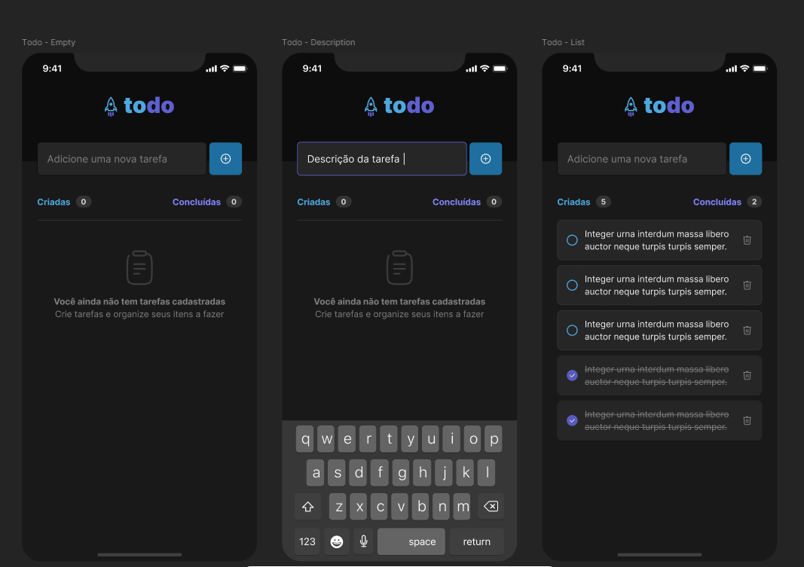

<!--Banner e logo-->

<h1 align="center">
   App To.do
</h1>

<!-- Badges -->
<p align="center">
   <a href="https://www.linkedin.com/in/rafael-bezerra-088b83a1/">
      
   </a>

  
</p>

<!-- Indice-->
<p align="center">
 <a href="#-sobre-o-projeto">Sobre</a> •
 <a href="#-Funcionalidades">Funcionalidades</a> • 
 <a href="#-Preview">Preview</a> • 
 <a href="#-Layout">Layout</a> •  
 <a href="#-como-executar-o-projeto">Executando</a> • 
 <a href="#-tecnologias">Tecnologias</a> • 
 <a href="#-licença">Licença</a>
</p>

<!--Sobre o projeto-->

## 💻 Sobre o projeto

O projeto foi desenvolvido como um desafio do curso de React-Native **Ignite** da [Rocketseat](https://nextlevelweek.com/episodios/discovery/1/edicao/2), o objetivo era aplicar os conceitos básicos aprendidos construindo um aplicativo de tarefas.

As funcionalidades foram apresentadas na descrição do desafio, além do design no **[Figma](https://www.figma.com/file/3zXncZpkn8TmAdZyd5a56G/Desafio-1-Tasks?node-id=11%3A2)**, além de permitir a escolha de outros temas.

<!--Funcionalidades do projeto-->

## ⚙️ Funcionalidades

Além das funcionalidades pedidas no desafio, adicionei outras extras para desenvolver novas habilidades:

- [x] Adicionar tasks;
- [x] Marcar como concluídas;
- [x] Deletar tasks;
- [x] Exibir alerta pedindo confirmação ao deletar uma tarefa (extra);
- [x] Tema light e dark (extra);
- [x] Contador com total (extra);

---

## Preview

<h1 align="center">
   
</h1>

<!--Layout session-->

## 🎨 Layout



<!--Running session-->

## 🚀 Como executar o projeto

```bash

# Clone o repositório
git clone https://github.com/sbezerrarafa/toDoList

# Instale as dependências
npm install

# Execute o projeto
npx expo start

```

---

<!--Tecnologies session-->

## 🛠 Tecnologias

As seguintes ferramentas foram usadas na construção do projeto:

#### **Front-end**

- **[CSS](https://developer.mozilla.org/pt-BR/docs/Web/CSS)**
- **[TypeScript](https://www.typescriptlang.org/)**
- **[React-Native](https://reactnative.dev/)**

<!--License session-->

## 📝 Licença

Este projeto está sob a licença [MIT](./LICENSE).

---

<!--Bottom session-->
<h4 align=center>Desenvolvido por Rafael Bezerra <a href="https://www.linkedin.com/in/rafael-bezerra-088b83a1/"> <strong>Entre em contato</strong> :)</a></a></h4>
